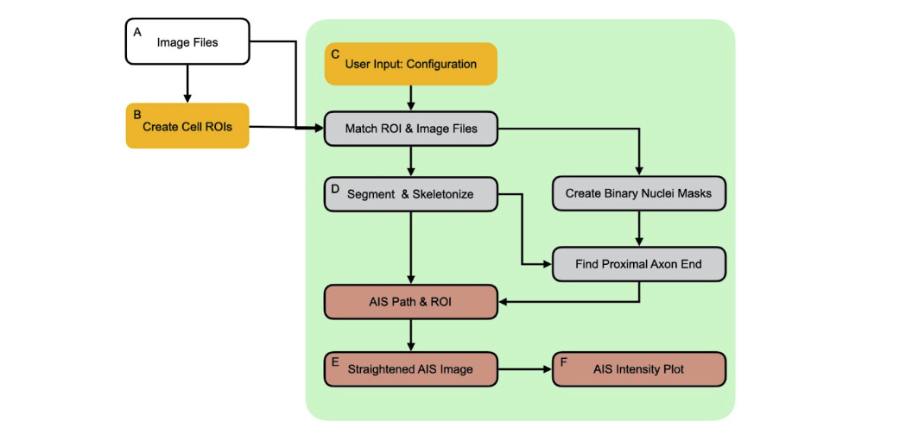
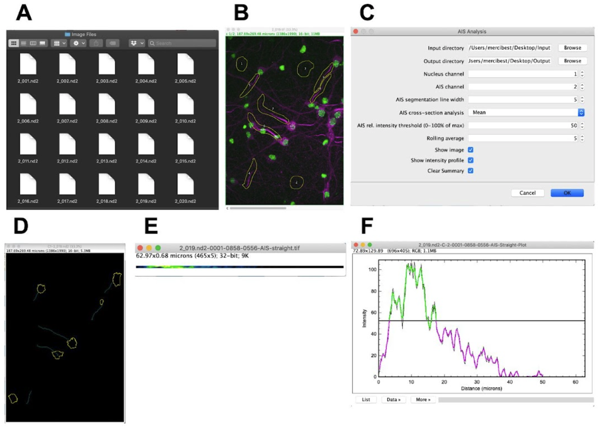
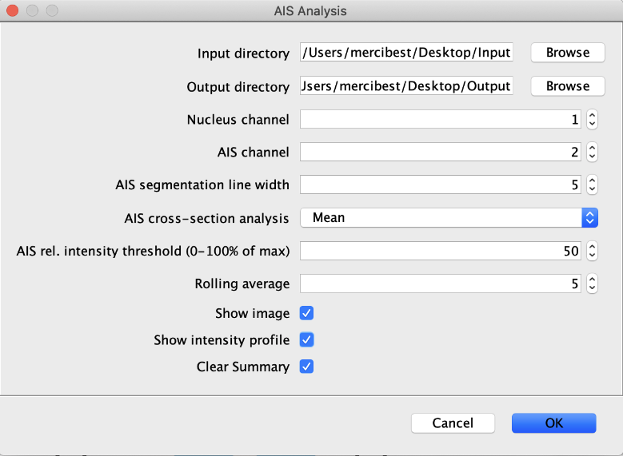
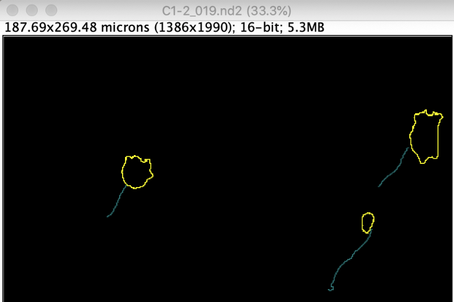
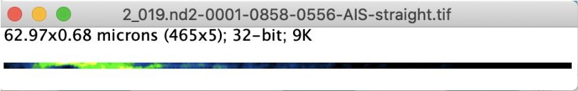
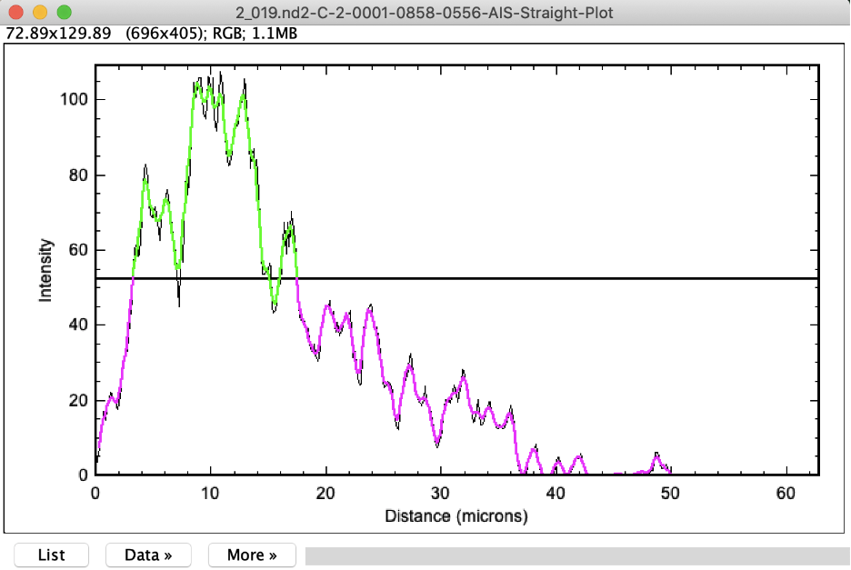

# AIS Analyzer

## Overview

The AIS Analyzer is an image analysis plugin for Fiji/ImageJ to aid in the quantification of axon initial segment (AIS) morphometric parameters. These include (1) AIS length, (2) AIS distance from cell soma, and (3) fluorescence intensity profiles of AIS markers. The purpose of the analysis and output is to improve the rigor, reproducibility, and reliability of AIS measurements compared to those done manually.

## Prerequisites

In order to use the plugin, download and install the Fij application (available here https://imagej.net/software/fiji/).

## Plugin installation

1. Download the source code by either cloning this repository: `git clone https://github.com/ksiller/aisanalyzer.git`, or alternatively download and unpack the zip archive of this repositry.

2. Start Fiji.

3. In Fiji, go to **Plugins** > **Install…**.

4. In the first pop-up dialog browse to and select the **AIS_Analysis.py** script. Click **Open**.

5. In the second dialog window, select the plugins directory (or a subdirectory within plugins) to where the script should be installed. Click **Save**.

6. After installing the script as plugin, restart Fiji.

7. In Fiji, go to **File** > **Plugins** and verify that the script is available. The `_` (underscore) and file extension are stripped from the plugin name. 

## Setting up the data

The plugin processes pairs of fluorescent images and corresponding Fiji/ImageJ region-of-interest (ROI) files. 

1. Set up a folder with multi-channel images (with at least two channels and FIJI-supported).

2. In Fiji, create for each image file a corresponding ROI file.

    a. Three background ROIs: 
    
        * Use freehand selection (bean shaped in the FIJI toolbar). Right-click to select. 
        
        * Find areas with no real axon initial segment marker signal and draw a shape.
        
        * Press “T”, to add shape as an ROI to ROI manager

    b. All AIS ROIs
    
        * Use freehand selection tool. Right-click to select.
    
        * Find AISs that meet the following criteria:
        
            * There is a clear nuclei
            
            * The AIS is not cut off on the edge of the image
            
            * There are no overlapping AISs.
            
        * Press “T”, to add shape as an ROI to ROI manager
        
        * Repeat this for as many AIS as you can find.
        
    c. Save set of ROIs in *ROI Manager* as a zip file with the same name as the image, but use .zip extension instead.
    
    d. Repeat steps for all of the images in the folder

    
    e. Save the sets of ROIs as zip file. The ROI filename must match the name of the respective multi-channel image it belongs to. 
    
## Running the Plugin

In Fiji, go to *Plugins* > *AIS_Analysis*. This will start the plugin and display a dialog to configure analysis parameters

* **Input directory:** folder with 1) multi-channel images (with at least two channels and FIJI-supported) and 2) region of interest (ROIs; must match the name of the respective multi-channel image as a zip file) to process. 

* **Output directory:** empty folder to store 1) nucleus ROIs, 2)AIS ROIs, and 3) results

* **Nucleus channel:** number indicating which channel the nuclei stain is located.

* **AIS channel:** number indicating which channel the AIS stain is located.

* **AIS segmentation line width:** thickness of the line used to trace the AIS.

* **AIS cross-section analysis:** 

* **AIS rel. Intensity threshold (0-100% of max):** the percentage of signal used as a cut-off to determine AIS from background signal.

* **Rolling average:** 

* **Show image:** select if you would like to see the images in real-time as the plugin analyzes the data

* **Show intensity profile:** select if you would like to see the AIS intensity plot profile in real-time as the plugin analyzes the data 

* **Clear summary:** select if you would like summary data from a previous folder to be erased before analyzing the next folder

Clik **OK** to run the plugin on all images in the chosen input directory

## Output

It’s recommended that you verify the accuracy of the automated nuclei and AIS outlines by overlaying them with the original input image. We also recommend you verify the accuracy of the distance from the nucleus. If the distance from the nuclei is incorrect, you can manually measure by using the straight line tool. Or crop your images to ensure that you only have one nucleus per image.  

The csv files can be processed in your software of choice for further analysis.

